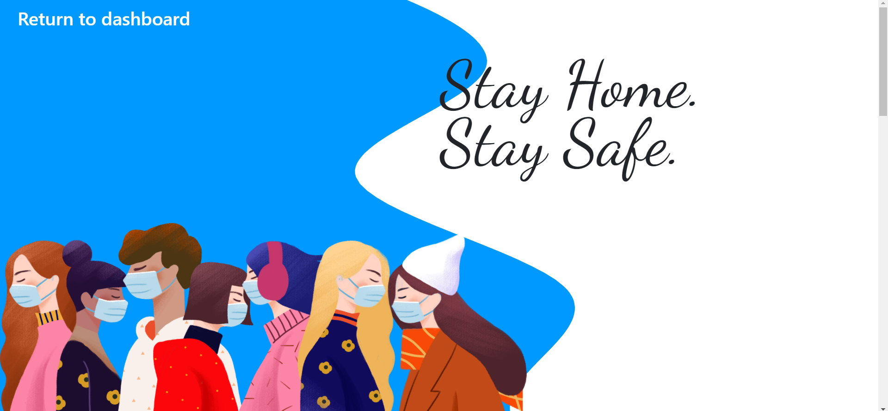
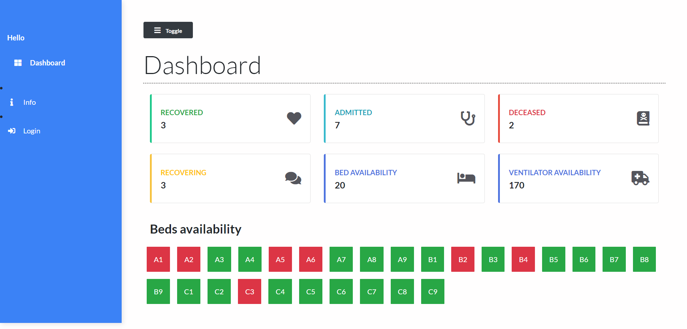
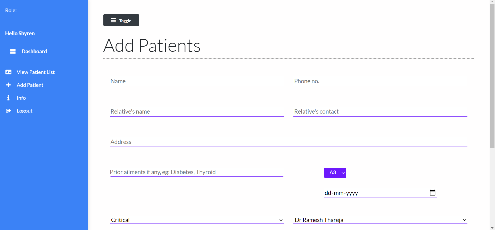
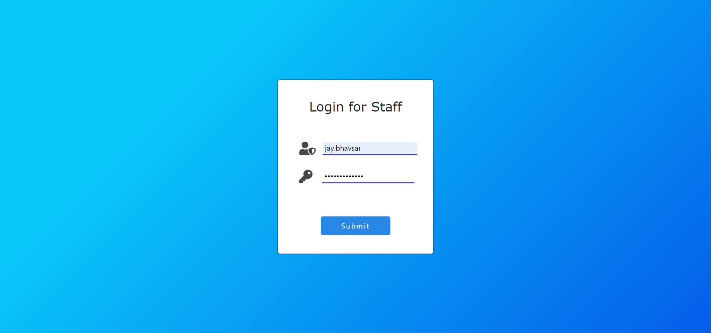
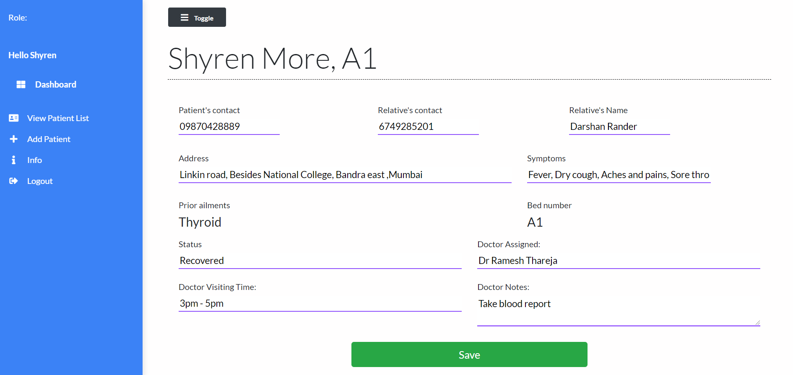

# _Covid19 hospital management_

<!-- about us & view patient -->

### Tech Stack
- Frontend
	- HTML5
	- CSS3
	- JQuery
    - Bootstrap4
- Backend
    - Django framework
- Database
    - SQLite

### Local Setup
- Clone repository.
- Setup virtual environment
- Exceute `pip install -r requirements.txt`.
- run `python manage.py runserver`.
- Go to `127.0.0.1::8000` in your web browser.
